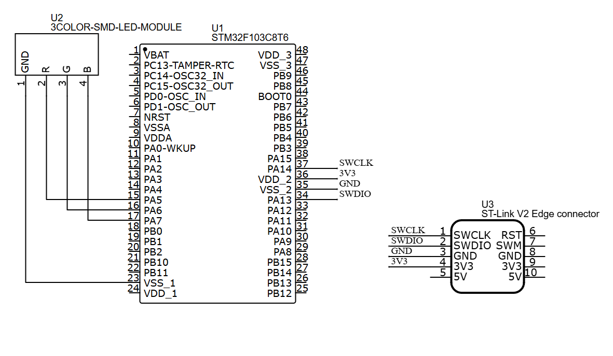

# 01_Blink_LED – STM32 Project

## Overview
This project demonstrates controlling an **RGB LED (KY-016, common cathode)** using **STM32F103C8T6 (Blue Pill)**.  
The LED cycles through Red, Green, and Blue colors with a fixed delay.

---

## Hardware
- STM32F103C8T6 (Blue Pill)  
- RGB LED KY-016 + resistors (220–330Ω for each color pin)  
- Breadboard & jumper wires  

**Pinout:**  
| STM32 Pin | Function   |
|-----------|------------|
| PA5       | LED Red    |
| PA6       | LED Green  |
| PA7       | LED Blue   |

---

## Features
- Cycles through Red → Green → Blue LEDs.  
- Demonstrates basic **GPIO Output** with HAL.  
- Adjustable blink speed using `HAL_Delay()`.  

---

## Quick Start
1. Connect RGB LED pins to PA5, PA6, PA7 via resistors.  
2. Open the project in **STM32CubeIDE**.  
3. Build the project.  
4. Flash firmware using **ST-LINK/V2**.  
5. Observe the LED cycling through the three colors.  

---

## Demo

### Images
- **Wiring Diagram**  
  

- **Demo Board**  
  

---

## Notes
- Ensure resistors are connected in series with LED pins (KY-016 has no built-in resistors).  
- Power the board via USB (5V) or regulated 3.3V supply.  
- This project is a base example for extending with buttons or PWM effects.  

---
