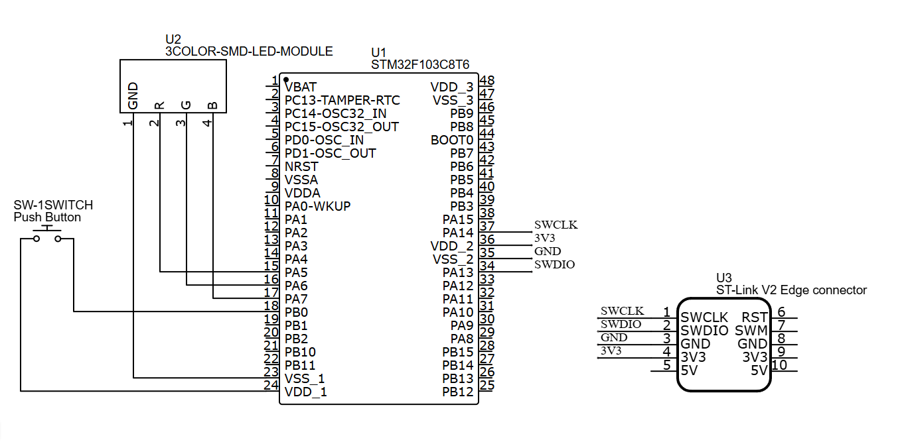

# 02_Button_LED – STM32 Project

## Overview
This project demonstrates controlling an **RGB LED** using a **push button input** on STM32F103C8T6 (Blue Pill).  
When the button is pressed, the LED color changes in sequence: **Red → Green → Blue**.

---

## Hardware
- STM32F103C8T6 (Blue Pill)  
- RGB LED KY-016 (common cathode)  
- Push button (6x6x5mm, 2-pin)  
- Resistors (220Ω – 330Ω for each LED pin)  
- Breadboard & jumper wires  

**Pinout:**  
| STM32 Pin | Function |
|-----------|----------|
| PA5       | LED Red  |
| PA6       | LED Green|
| PA7       | LED Blue |
| PA0       | Button   |

---

## Features
- Press button to change LED color.  
- Demonstrates **GPIO Input (button)** and **GPIO Output (LED)**.  
- Basic debounce handled with `HAL_Delay()`.  

---

## Quick Start
1. Connect RGB LED pins to PA5, PA6, PA7 via resistors.  
2. Connect push button to PA0 with internal pull-up enabled.  
3. Open the project in **STM32CubeIDE**.  
4. Build the project.  
5. Flash firmware using **ST-LINK/V2**.  
6. Press the button to cycle through Red → Green → Blue.  

---

## Demo
### Wiring Diagram

### Demo Board

### Demo Video

---

## Notes
- Enable **GPIO_PULLUP** for PA0 to avoid floating input.  
- Ensure stable power supply (USB 5V or regulated 3.3V).  
- Can be extended with timer-based debounce or PWM brightness control.  

---
