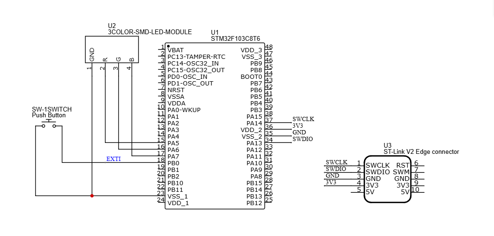
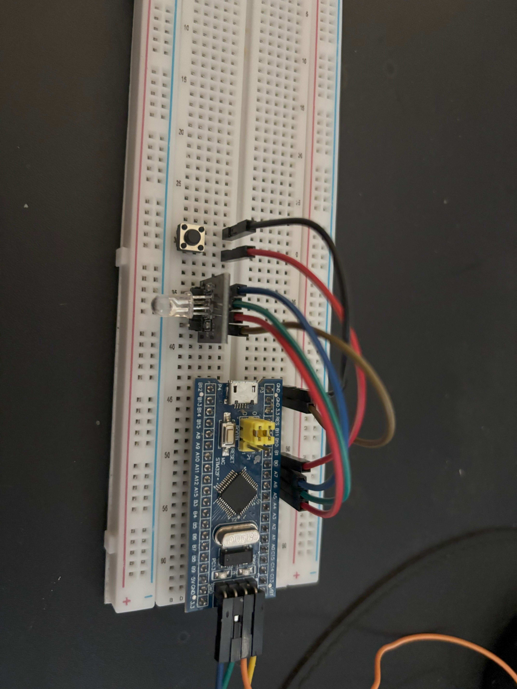

# 03_Interrupt_RGB_LED – STM32 Project

This project demonstrates controlling an RGB LED using an external interrupt (EXTI) from a push button on STM32F103C8T6 (Blue Pill).  
Each button press cycles the LED color in sequence: Red → Green → Blue.

---

## Components
- STM32F103C8T6 (Blue Pill)
- RGB LED KY-016 (common cathode)
- Push button (6x6x5mm, 2-pin)
- Resistors (220Ω – 330Ω for each LED pin)
- Jumper wires
- Breadboard

---

## Pinout

| STM32 Pin | Function   |
|-----------|------------|
| PA5       | LED RED    |
| PA6       | LED GREEN  |
| PA7       | LED BLUE   |
| PB0       | Button (EXTI0) |

---

## Features
- External interrupt with EXTI on PB0.  
- Press button → change RGB LED color (Red → Green → Blue).  
- Demonstrates interrupt-driven programming.  
- Background task: Blue LED toggles every 1 second in `main()` while interrupt works independently.  

---

## Steps to Run
1. Connect RGB LED to PA5, PA6, PA7 (via resistors).  
2. Connect push button to PB0 (with pull-up or pull-down resistor).  
3. Open the project in STM32CubeIDE.  
4. Build the project.  
5. Flash firmware to STM32 using ST-LINK/V2.  
6. Press the button to cycle LED colors. Observe background LED toggling.  

---

## File Structure
- `Core/Src/` : main program (C source files)  
- `Core/Inc/` : header files  
- `Drivers/` : HAL library  
- `03_Interrupt_RGB_LED.ioc` : STM32CubeMX configuration  
- `Images/` : wiring diagram and demo photos  

---

## Demo
### Wiring Diagram

### Demo Board

### Demo Video

---

## Future Work
- Add debounce using timer-based method.  
- Implement short press vs long press detection.  
- Use PWM for RGB fading effects.  

---

## Notes
- Ensure EXTI0 is enabled in NVIC configuration.  
- Button must be wired correctly (GND + pull-up or VCC + pull-down).  
- Use stable power supply (USB 5V or regulated 3.3V).  

---

## License
This project is provided AS-IS for learning and portfolio purposes.
