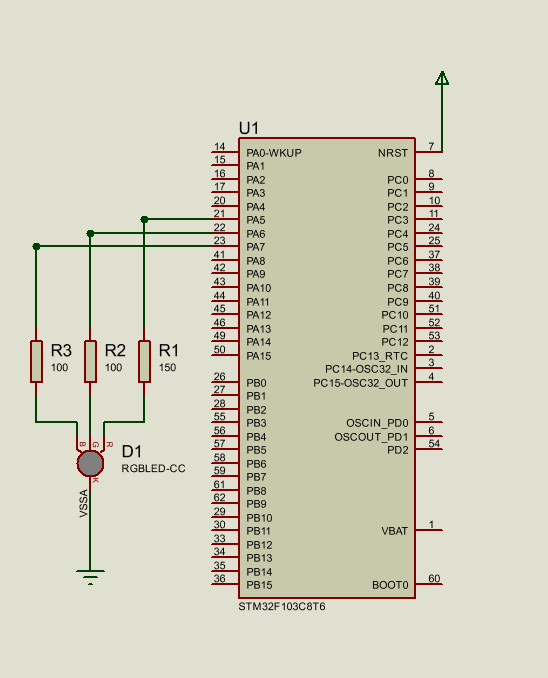
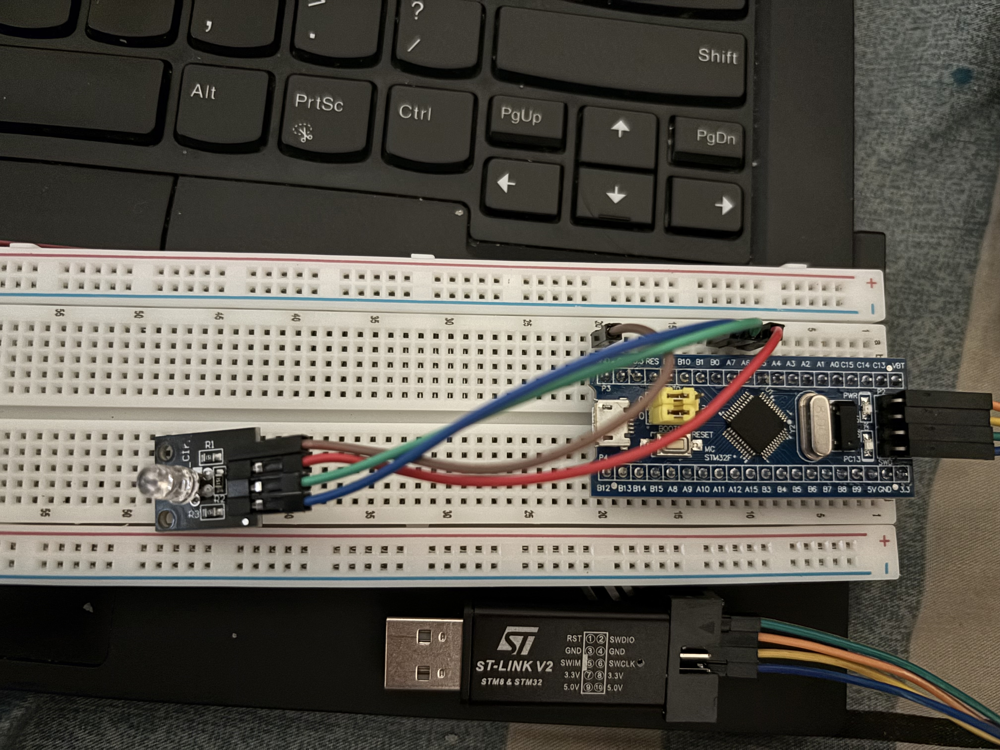

# RGB LED STM32 Project
This project demonstrates controlling an RGB LED using STM32F103C8T6 (Blue Pill) microcontroller.
The program cycles through red, green, and blue colors with different blinking patterns.

## Components
- STM32F103C8T6 (Blue Pill)
- RGB LED KY-016
- Jumper wires
- Breadboard

## Features
- Toggle RED, GREEN, BLUE LEDs with delay
- RGB color cycling
- Simple GPIO output using HAL library

## Wiring Diagram

## Demo Board

## Steps to Run
1. Connect the RGB LED to PA5 (RED), PA6 (GREEN), PA7 (BLUE) via resistors.
2. Open the project in STM32CubeIDE.
3. Build the project.
4. Flash firmware to STM32 using ST-Link.
5. Power on the board and observe the LED cycling through RED, GREEN, BLUE.
6. Adjust `HAL_Delay()` in `main.c` to change blink speed (optional).

## File Structure
- `Src/` : main program controlling the LED
- `Inc/` : header files
- `Drivers/` : HAL library
- `images/` : wiring diagram and board photos

## Demo Video

## Notes
- Ensure correct HAL libraries are included.
- Check power supply stability (5V via USB or 3.3V regulated).
- LED KY-016 does not include resistors internally, external resistors are required.

## License
This project is provided AS-IS for learning purposes.
